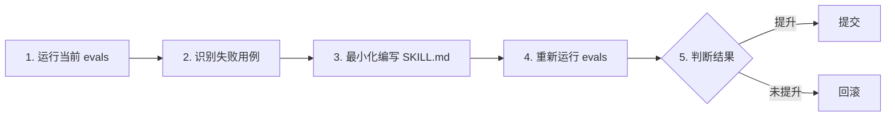

# SKILL.md 编写规范

> 参考：Andrej Karpathy "上下文工程" + Anthropic Skills 官方实践 + dbexplain 项目实际经验
> SKILL.md = AI 编程助手的项目级 prompt，教会 AI 如何操作该项目

---

## 一、核心理念

1. **读者是 AI** — 所有内容面向大语言模型优化，不是给人看的文档。使用清晰、直接、可执行的指令。
2. **上下文经济** — 上下文窗口是稀缺公共资源。只包含 AI **不知道**或**难以推断**的领域知识，不重复通用常识。每多一条指令，就多一分忽略关键指令的风险。
3. **可执行优先** — 每条命令都应是可直接复制运行的完整语句（如 `dbexplain -env --context ./ctx`），不含 `<占位符>` 或"根据情况调整"。
4. **越具体越好** — 不写模棱两可的空话。提供的信息越精确，AI 表现越像老手。
5. **可验证性** — 技能应附带测试用例（evals）。没有评估，就无法判断修改效果。

### 黄金法则

> 把提示词给一个没有背景知识的同事看，如果他看不懂，模型也看不懂。
> — Anthropic 工程师

> 一条内容删掉后，AI 的执行质量是否会显著下降？会→保留，不会→删除。

---

## 二、文件位置与命名

### 位置

```
{project_root}/dbexplain-skill/SKILL_ZH.md          # 主技能（中文，默认）
{project_root}/dbexplain-skill/SKILL_ZH.md          # 中文版
{project_root}/dbexplain-skill/SKILL_EN.md          # 英文版
{project_root}/dbexplain-skill/SKILL_{模型}.md      # 特定模型优化的版本
{project_root}/dbexplain-skill/references/          # 外部参考文件
```

### 命名规范

- 技能名：`{project}-{function}`，全部小写，连字符分隔
- 例如：`dbexplain-skill`、`dbexplain-file-analysis`
- 中英文版使用相同 name

### 触发词

- 写**用户实际会说的话**，而非技术术语
- 好的：`"分析CSV数据"`、`"触达率排行"`
- 不好的：`"测试CSV文件"`（用户不这么说）、`"QA回归测试"`（AI 视角而非用户视角）

---

## 三、YAML Frontmatter

每个 SKILL.md **必须**以 YAML frontmatter 开头。

### ⚠️ 关键机制：元数据是入口

AI 先扫描 frontmatter（约 100 tokens）判断是否加载完整 SKILL.md。**`description` 是技能的唯一"广告位"** — 无效的描述意味着技能永远不会被调用。

```yaml
---
name: dbexplain-skill                    # 技能唯一标识
description: >                           # AI 匹配技能的依据（⚠️ 最重要字段）
  当用户需要探查数据库结构、分析跨库关系、执行只读查询或检查数据库健康时使用此技能。
  输入：DSN 连接串或 .env 配置文件。输出：表结构/字段注释/关系图谱/健康评分的 JSON。
version: 1.0.0                           # 可选：语义化版本
user-invocable: true                     # 是否允许用户显式调用
trigger:                                 # 用户输入中触发此技能的关键词
  - "解释表结构"
  - "分析数据库关系"
tags: [database, sql, csv]              # 可选：分类标签
dependencies:                            # 可选：依赖声明
  - tool: dbexplain
    min_version: 0.1.0
---
```

### description 写作公式

```
当用户需要 {触发场景} 时使用此技能。
输入：{输入定义}。输出：{输出格式}。
```

| 示例 | 评价 |
|------|------|
| `当用户需要分析 CSV/XLSX 数据、执行 SQL 风格查询或生成统计报表时使用此技能。输入：文件路径 + SELECT 查询。输出：表格或 JSON。` | ✅ 触发场景 + 输入 + 输出 |
| `数据分析工具` | ❌ 太模糊，无触发条件，无输入输出定义 |

---

## 四、内容结构

### 1. 概述

简要说明工具是什么、能做什么。**聚焦于此技能关心的能力**，不需要列出所有功能。

**好的写法：**
```
dbexplain v0.1.0+ 文件查询引擎对 CSV/XLSX 支持完整 SELECT 子集：
- WHERE 过滤、GROUP BY + 聚合、ORDER BY 排序、LIMIT 分页
- 跨文件哈希 JOIN、列间算术、CAST/ABS/LIKE/IN/BETWEEN
- UNION / UNION ALL / 子查询
```

### 2. 输入定义（⚠️ 必填）

明确定义 AI 需要从用户处获取的信息。**输入缺失时 AI 应主动询问，不猜测。**

| 参数 | 类型 | 必填 | 说明 |
|------|------|------|------|
| DSN 配置 | 文件路径 / 连接串 | ✅ | `.env` 文件路径或 direct DSN 字符串 |
| 查询语句 | string | 按需 | SELECT 查询（execute 模式），不提供则只做 Schema 采集 |
| 输出格式 | enum | ❌ | `--human`（表格）或默认 JSON |

### 3. 核心规则

AI 必须遵守的行为约束。建议 3-7 条，复杂技能可适度增加，但每条都应有明确价值。

```
- 只读安全：仅执行 SELECT / SHOW / SCAN。绝不写入数据。
- 隐私保护：绝不查看/记录/要求明文密码。让用户自行在 .env 中配置。
- 职责边界：Agent 只调用工具，绝不创建/修改/读取配置文件内容。
- 失败处理：命令报错时停止执行，如实报告错误信息。不猜测替代参数，不假装成功。
```

### 4. 标准工作流

分步骤描述 AI 应如何操作。**每个步骤包含可复制执行的命令**。

```
### 步骤 1：Schema 采集
dbexplain -env --context ./ctx

### 步骤 2：数据预览
dbexplain execute -env --label <label> 'SELECT *' --limit 5 --human

### 步骤 3：业务分析
dbexplain execute -env --label <label> 'SELECT col, AVG(val) FROM t GROUP BY col' --human
```

### 5. 业务知识 / 领域知识（可选但强烈推荐）

对于业务分析技能，此部分至关重要。告诉 AI：
- 数据是什么、粒度如何、覆盖范围
- 关键字段含义
- 常见的坑（如字段拼写错误、特殊值含义、聚合时的注意事项）

### 6. 常见场景（可选）

列出 AI 可能会遇到的主要使用场景，附上对应命令。

### 7. 快速参考（可选）

以表格形式罗列最常用（不超过 6 个）的参数。完整参数列表指向 `dbexplain all`。

### 8. 验证检查清单（可选，仅开发/测试用）

> 此章节不传递给运行时的 AI，仅供技能作者自测。

- [ ] 输入缺失时 AI 是否主动询问？
- [ ] 错误输入是否给出清晰报错？
- [ ] 正常查询能否在预期时间内返回？

---

## 五、禁止的内容

| 内容 | 理由 | 替代位置 |
|------|------|----------|
| 测试结果（如"测试通过"、"PASS"） | 对 AI 无意义 | `docs/test/RESULTS.md` |
| 变更历史 / CHANGELOG | AI 不需要知道版本演进 | `CHANGELOG.md` |
| TODO 列表 / 未完成事项 | 无助于当前执行 | Issue tracker |
| 数据文件路径细节 | 过于具体的内网路径 | 配置文件 |
| 环境安装步骤（一次性操作） | 非日常使用 | `scripts/` 或 `README.md` |
| 每步命令的预期输出（>5 行） | 浪费 token | `docs/test/` |
| 模棱两可的表述（"可能""一般""根据需要"） | AI 会困惑 | 删除或明确条件 |

> 注意：QA 检查清单作为 §4.8 的可选内容不在此限，但需明确标注"仅开发/测试用"。

---

## 六、文件大小与拆分策略

### 大小约束

- 目标：**150-200 行**（约 5k tokens）
- 超过 250 行 → 必须拆分
- 超过 400 行 → 必然注水，必须大幅删减

### 引用外部文件（渐进披露）

SKILL.md 应保持精简，长内容拆分到外部文件。AI 遵循**按需加载**原则。

```
查询语法参考：dbexplain-skill/references/sql-syntax.md。
错误排障指南：dbexplain-skill/references/troubleshooting.md。
```

---

## 七、版本管理与迭代流程

### 版本更新

- 修改 description 或核心行为 → major 版本号递增
- 新增场景或优化指令 → minor
- 修复错别字、调整示例 → patch

### 迭代流程（eval-first）



**核心原则**：无评估，不修改。

---

## 八、完整示例模板

```markdown
---
name: dbexplain-skill
description: >
  当用户需要探查数据库结构、分析跨库关系或执行只读查询时使用此技能。
  输入：DSN 连接串或 .env 配置。输出：表结构/字段注释/关系图谱 JSON。
version: 1.0.0
user-invocable: true
trigger:
  - "解释表结构"
  - "数据库巡检"
tags: [database, sql, csv]
---

## 1. 工具概述

`dbexplain` 是 Go 二进制 CLI，已安装到系统 PATH。支持 11 种数据源。

## 2. 输入定义

| 参数 | 类型 | 必填 | 说明 |
|------|------|------|------|
| DSN 配置 | 文件/字符串 | ✅ | .env 文件路径或 direct DSN |
| 查询语句 | string | 按需 | SELECT（execute 模式）|
| 输出格式 | --human | ❌ | 表格输出，默认 JSON |

## 3. 核心规则

- **只读安全**：仅执行 SELECT。绝不写入数据。
- **隐私保护**：绝不查看明文密码。
- **失败处理**：报错时如实报告，不猜测。

## 4. 标准工作流

### 4.1 Schema 采集
```bash
dbexplain -env --context ./ctx
```

### 4.2 执行查询
```bash
dbexplain execute -env --label <label> 'SELECT COUNT(*) FROM t' --human
```

完整语法见 `references/sql-syntax.md`，排障见 `references/troubleshooting.md`。

## 5. 注意事项

- 密码含特殊字符：命令行用单引号包裹 DSN
- ClickHouse：REPL 模式自动去除尾部 `;`，`execute` 命令行建议不加
- 完整帮助：`dbexplain all`
```
