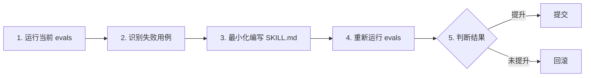

# SKILL.md 编写规范

> 基于 Karpathy 五层技能模型（Role → Workflow → Knowledge → Tool → Eval），
> 结合 dbexplain 项目实际经验与 Anthropic Skills 官方实践。
>
> SKILL.md = AI 编程助手的项目级 prompt，教会 AI 如何操作该项目。
> 读者：所有需要编写/修改 dbexplain SKILL.md 的开发者。

---

## 一、核心理念

### 0. 场景驱动编写（新增）

SKILL.md 的本质是**将 CLI 工具的能力映射为用户场景**。不是按 CLI 功能模块（collect/execute/DSL）组织，而是按**用户想解决的问题**组织。

**为什么重要**：AI 接到的是用户自然语言请求（"帮我看看数据库有啥问题"），不是 CLI 命令（"跑一下 collect"）。SKILL 必须提供从用户意图到命令的桥梁。

#### 场景三要素

```
用户说 "帮我巡检一下数据库"
  → AI 执行: dbexplain --context ./ctx → 读 diagnostics.json
  → 验证: diagnostics.json 包含 issues[] 列表
  → 降级: 连接失败 → dbexplain check 检查连通性
```

#### P0/P1/P2 分级（控制内容优先级）

不是所有场景同等重要。内容排列按用户使用频率：

| 等级 | 场景 | 用户说 | 占 SKILL 篇幅 |
|------|------|--------|-------------|
| **P0** | 数据库巡检、表结构查看、连通性检查 | "看看数据库""查下表" | **40%** — 放最前 |
| **P1** | 只读查询、数据统计、数据源总览 | "查下数据""统计一下" | **35%** — 中间位置 |
| **P2** | Schema Diff、联邦查询、DSL 模式 | "和上周比改了啥""跨库查" | **15%** — 靠后或 references |
| **P3** | 配置加密、REPL 交互 | "加密配置""REPL" | **10%** — 注意事项 |

**原则**：如果一个场景 80% 的用户用不到，它就不应该在 SKILL 前 50% 的篇幅里。

#### 常见场景模板

```markdown
### 场景：{用户说的典型话}

{一句话判断：什么时候走这条路径}

```bash
# 第一步命令
dbexplain {command}
```
→ verify: {验证条件}

失败 → {降级路径}

完整参考：`references/{xxx}.md`
```

#### 内容组织检查清单

- [ ] 前 50% 篇幅是否覆盖所有 P0 场景？
- [ ] P2/P3 内容是否被拆到 references/ 或 SKILL 后半部分？
- [ ] 每个场景是否包含"用户说的 → 命令 → 验证 → 降级"？
- [ ] 用户说的内容是否来自真实用户提问，而非技术术语？
- [ ] 每个场景是否对应一个具体的数据源类型（SQL/NoSQL/文件/Prometheus）？

---

1. **读者是 AI** — 所有内容面向大语言模型优化，不是给人看的文档。使用清晰、直接、可执行的指令。
2. **上下文经济** — 上下文窗口是稀缺公共资源。只包含 AI **不知道**或**难以推断**的领域知识，不重复通用常识。每多一条指令，就多一分忽略关键指令的风险。
3. **可执行优先** — 每条命令都应是可直接复制运行的完整语句，不含 `<占位符>` 或"根据情况调整"。
4. **越具体越好** — 不写模棱两可的空话。提供的信息越精确，AI 表现越像老手。
5. **可验证性** — 技能应附带验证标准（eval）。没有标准，就无法判断修改效果。

### 黄金法则

> 把提示词给一个没有背景知识的同事看，如果他看不懂，模型也看不懂。

> 一条内容删掉后，AI 的执行质量是否会显著下降？会→保留，不会→删除。

---

## 二、Karpathy 五层模型

技能编写遵循 Karpathy 五层模型：**Role → Workflow → Knowledge → Tool → Eval**。
每层回答一个问题：

| 层 | 英文 | 问题 |
|----|------|------|
| Role | What it is | 这个技能是什么？什么时候触发？ |
| Workflow | What it does | 怎么做？执行步骤是什么？ |
| Knowledge | What it knows | 需要哪些知识资产？ |
| Tool | What it uses | 使用哪些工具/命令？ |
| Eval | What good looks like | 什么叫做好？如何验证？ |

### Role Layer

`description` 是技能的唯一"广告位" — AI 先扫描 frontmatter（约 100 tokens）判断是否加载完整 SKILL.md。无效的描述意味着技能永远不会被调用。

必须使用 **Rich Description** 模式（见 §六），覆盖触发条件、核心能力、输入输出。

### Workflow Layer

分步骤描述 AI 应如何操作。**每个步骤包含可复制执行的命令**。信息按"执行顺序"排列，不按"重要性"排列 — LLM 顺序阅读，越在前面越优先关注。

```
§4.1 确认安装 → §4.2 配置连接 → §4.3 采集 Schema → §4.4 执行查询
```

每条 Workflow 步骤应附带 **验证点**（verification checkpoint），见 Generation → Verification 模式（§六）。

### Knowledge Layer

技能通过本地知识资产获得深度。详细参考内容存入 `references/` 目录，SKILL.md 中通过相对路径引用：

```
查询语法参考：dbexplain-skill/references/sql-syntax.md。
错误排障指南：dbexplain-skill/references/troubleshooting.md。
```

### Tool Layer

明确标注技能依赖的工具/命令。对于 CLI 工具（如 `dbexplain`），使用 CLI 工具引用规范（§六），不在 SKILL.md 中堆砌完整参数表。

### Eval Layer — 定义"什么叫做好"

每个技能必须明确定义执行成功的标准。放在 `## eval` 章节或作为 workflow 最后的验证步骤。

**评估维度**：

| 维度 | 问题 |
|------|------|
| 完整性 | Schema 采集是否包含所有表？ |
| 正确性 | 查询结果是否与预期一致？ |
| 安全性 | 是否有写入操作被拦截？ |

```markdown
## eval
- Schema 采集：所有 DSN 成功返回 → ✅
- 只读查询：返回 columns + rows，非空 → ✅
- 安全拦截：DROP/INSERT 等被明确拒绝 → ✅
- 任何一条不满足 → 标记降级

## fallback
- [DSN 连接失败] → 报告具体错误信息，不猜测原因
- [查询超时] → 建议加 `--timeout` 或简化查询
```

---

## 三、文件位置与命名

### 位置

```
{project_root}/dbexplain-skill/SKILL_ZH.md          # 主技能（中文，默认）
{project_root}/dbexplain-skill/SKILL_EN.md          # 英文版
{project_root}/dbexplain-skill/references/          # 外部参考文件
{project_root}/dbexplain-skill/scripts/             # 安装/卸载脚本
```

### 命名规范

- 技能名：`{project}-{function}`，全部小写，连字符分隔
- 例如：`dbexplain-skill`、`dbexplain-file-analysis`
- 中英文版使用相同 `name`

### 触发词

- 写**用户实际会说的话**，而非技术术语
- 好的：`"分析CSV数据"`、`"触达率排行"`
- 不好的：`"测试CSV文件"`（用户不这么说）、`"QA回归测试"`（AI 视角而非用户视角）

---

## 四、YAML Frontmatter

每个 SKILL.md **必须**以 YAML frontmatter 开头。

```yaml
---
name: dbexplain-skill                    # 技能唯一标识
description: "..."                       # Rich Description（见 §六）
user-invocable: true                     # 是否允许用户显式调用
trigger:                                 # 用户输入中触发此技能的关键词
  - "解释表结构"
  - "数据库巡检"
  - "数据源概览"
---
```

### description 写作公式

```
当用户需要 {触发场景} 时使用此技能。
输入：{输入定义}。输出：{输出格式}。
```

| 示例 | 评价 |
|------|------|
| `当用户需要分析 CSV/XLSX 数据、执行 SQL 风格查询或生成统计报表时使用此技能。输入：文件路径 + SELECT 查询。输出：表格或 JSON。` | ✅ 触发场景 + 输入 + 输出 |
| `数据分析工具` | ❌ 太模糊，无触发条件，无输入输出定义 |

**keyword density**: description 应包含 8-15 个触发关键词，确保 LLM 在任意角度都能匹配。

---

## 五、内容结构

### 1. 工具概述

简要说明工具是什么、能做什么。**聚焦于此技能关心的能力**，不需要列出所有功能。

**好的写法：**
```
dbexplain v0.1.0+ 文件查询引擎对 CSV/XLSX 支持完整 SELECT 子集：
- WHERE 过滤、GROUP BY + 聚合、ORDER BY 排序、LIMIT 分页
- 跨文件哈希 JOIN、列间算术、CAST/ABS/LIKE/IN/BETWEEN
- UNION / UNION ALL / 子查询
```

### 2. 输入定义（⚠️ 必填）

明确定义 AI 需要从用户处获取的信息。**输入缺失时 AI 应主动询问，不猜测。**

| 参数 | 类型 | 必填 | 说明 |
|------|------|------|------|
| DSN 配置 | 文件路径 / 连接串 | ✅ | `.env.dbexplain` 文件路径或 direct DSN 字符串 |
| 查询语句 | string | 按需 | SELECT 查询（execute 模式），不提供则只做 Schema 采集 |
| 输出格式 | enum | ❌ | `--human`（表格）或默认 JSON |

### 3. 核心规则

AI 必须遵守的行为约束。建议 3-7 条，复杂技能可适度增加，但每条都应有明确价值。

```
- **只读安全**：仅执行 SELECT / SHOW / SCAN。绝不写入数据。
- **隐私保护**：绝不查看/记录/要求明文密码。让用户自行在 .env 中配置。
- **职责边界**：Agent 只调用工具，绝不创建/修改/读取配置文件内容。
- **失败处理**：命令报错时停止执行，如实报告错误信息。不猜测替代参数，不假装成功。
```

### 4. 标准工作流

分步骤描述 AI 应如何操作。**每个步骤包含可复制执行的命令**。

```
### Before you start — ALWAYS ask
1. 确认用户是否有 `.env.dbexplain` 配置文件
2. 确认使用哪种数据源（SQL / NoSQL / 文件）
3. 确认分析目的（Schema 预览 / 数据查询 / 健康检查）

### 步骤 1：Schema 采集
dbexplain --context ./ctx

### 步骤 2：数据预览
dbexplain execute --label <label> 'SELECT *' --limit 5 --human
→ verify: 返回 columns + rows，row_count > 0

### 步骤 3：业务分析
dbexplain execute --label <label> 'SELECT col, AVG(val) FROM t GROUP BY col' --human
→ verify: 聚合结果包含所有分组，空值已处理
```

每 2-3 个步骤至少有一个验证点（→ verify:），验证失败走降级路径。

### 5. 边界（Boundaries）

"不能做什么"和"能做什么"同等重要。

```
## boundaries
- ❌ 绝不执行 DROP/INSERT/UPDATE/DELETE
- ❌ 绝不绕过错信息重试被安全策略拒绝的查询
- ❌ 绝不读取或修改用户配置文件
- ✅ 用户拒绝创建配置文件时，指导使用 `-dsn` 直接传参
- ✅ 连接失败时报告具体错误，不猜测原因
```

### 6. 业务知识 / 领域知识（可选但强烈推荐）

对于业务分析技能，此部分至关重要。告诉 AI：
- 数据是什么、粒度如何、覆盖范围
- 关键字段含义
- 常见的坑（如字段拼写错误、特殊值含义、聚合时的注意事项）

### 7. 常见场景（可选）

列出 AI 可能会遇到的主要使用场景，附上对应命令。详细示例见 `examples/usage.md`。

### 8. 快速参考（可选）

以表格形式罗列最常用（不超过 6 个）的参数。完整参数列表指向 `dbexplain all`。

### 9. 验证检查清单（可选，仅开发/测试用）

> 此章节不传递给运行时的 AI，仅供技能作者自测。

- [ ] 输入缺失时 AI 是否主动询问？
- [ ] 错误输入是否给出清晰报错？
- [ ] 正常查询能否在预期时间内返回？
- [ ] 所有 `references/` 和 `examples/` 引用实际存在？
- [ ] 每 2-3 个步骤有验证点？

---

## 六、交互设计模式

### Rich Description 模式

`description` 不能只有一句话。它需要覆盖**触发条件 + 核心能力 + 输入输出 + 边界场景**。

```
✅ 好的:
当用户需要探查数据库结构、分析跨库关系、执行只读查询或检查数据库健康时使用此技能。
输入：DSN 连接串或 .env.dbexplain 配置文件（自动发现）。输出：表结构/字段类型/健康评分的 JSON 或表格。

❌ 不好的:
数据库分析工具。
```

**keyword density**：description 应包含 8-15 个触发关键词，确保 LLM 在任意角度都能匹配。

### "Before you start — ALWAYS ask" 模式

在 workflow 的第一步定义前置确认。适用于涉及参数选择或用户上下文的技能。

```markdown
### Before you start — ALWAYS ask
1. 确认配置文件路径（`~/.config/dbexplain/.env.dbexplain`）
2. 确认目标数据源类型（SQL / NoSQL / 文件）
3. 确认输出格式（JSON 给 Agent 分析 / `--human` 给用户展示）
```

### Generation → Verification 循环

每步执行后立即验证，验证不通过则不继续。

```markdown
1. **Schema 采集**
   → dbexplain -json -o schema.json
   → verify: instances 数组非空，包含 label 和 kind
2. **执行查询**
   → dbexplain execute --label x 'SELECT COUNT(*) FROM t'
   → verify: row_count > 0，无 ACCESS_DENIED 错误
3. **分析结果**
   → LLM 合并 1-2 步结果，标注来源 SQL
   → verify: 每个数字有来源 SQL 标注
```

**规则**：
- 每 2-3 个步骤至少有一个验证点
- 验证点使用确定性检查（字段非空、数值范围），不依赖 LLM 判断
- 验证失败走降级路径

### CLI 工具引用规范

dbexplain 是 CLI 二进制，遵循以下规范以节省 token：

| 原则 | 说明 |
|------|------|
| **不套表格** | CLI 工具不在 SKILL.md 中列完整参数表。主要参数在 §2 输入定义中给出 |
| **SKILL.md 留核心示例** | 每个工作流步骤保留 1 条最常用的命令示例 |
| **`references/` 放参考文档** | 语法参考、排障指南等静态文档放 `references/` |
| **详细示例拆出** | 完整命令示例、所有 flag 组合、各数据源格式等指向对应章节或 `references/` |

**写法标准**：

```markdown
### 4.4 执行只读查询

先采集 Schema，明确字段含义后再查询。

```bash
dbexplain execute --label mysql 'SELECT COUNT(*) FROM orders' --human
```

自动 LIMIT 1000。完整查询语法见 `references/sql-syntax.md`。
```

**不推荐** — 在 SKILL.md 中罗列 20 个不同数据源的查询示例。

### 资产目录完整性规则

SKILL.md 中所有引用的文件必须实际存在于该技能目录下：

| SKILL.md 引用 | 必须存在的目录/文件 |
|---------------|-------------------|
| `references/sql-syntax.md` | `dbexplain-skill/references/sql-syntax.md` |
| `references/troubleshooting.md` | `dbexplain-skill/references/troubleshooting.md` |
| `scripts/install.sh` | `dbexplain-skill/scripts/install.sh` |

**检查清单**：
- [ ] `references/` 中引用的文档实际存在
- [ ] `scripts/` 中引用的脚本实际存在
- [ ] 未引用的冗余文件已清理

---

## 七、禁止的内容

| 内容 | 理由 | 替代位置 |
|------|------|----------|
| 测试结果（如"测试通过"、"PASS"） | 对 AI 无意义 | `docs/test/RESULTS.md` |
| 变更历史 / CHANGELOG | AI 不需要知道版本演进 | `CHANGELOG.md` |
| TODO 列表 / 未完成事项 | 无助于当前执行 | Issue tracker |
| 数据文件路径细节 | 过于具体的内网路径 | 配置文件 |
| 环境安装步骤（一次性操作） | 非日常使用 | `scripts/` 或 `README.md` |
| 每步命令的预期输出（>5 行） | 浪费 token | `docs/test/` |
| 模棱两可的表述（"可能""一般""根据需要"） | AI 会困惑 | 删除或明确条件 |

> 注意：QA 检查清单作为 §5.9 的可选内容不在此限，但需明确标注"仅开发/测试用"。

---

## 八、文件大小与拆分策略

### 大小约束

- 目标：**150-200 行**（约 5k tokens）
- 超过 250 行 → 必须拆分
- 超过 400 行 → 必然注水，必须大幅删减

### 引用外部文件（渐进披露）

SKILL.md 应保持精简，长内容拆分到外部文件。AI 遵循**按需加载**原则。

```
查询语法参考：dbexplain-skill/references/sql-syntax.md。
错误排障指南：dbexplain-skill/references/troubleshooting.md。
```

### References 目录模式

当 SKILL.md 超过 250 行或包含以下内容时，将详细资料移入 `references/`：

```
dbexplain-skill/
├── SKILL_ZH.md                # 主技能（≤250 行）
├── SKILL_EN.md                # 英文版
├── references/
│   ├── sql-syntax.md          # 查询语法参考
│   └── troubleshooting.md     # 常见问题排查
└── scripts/
    ├── install.sh
    └── uninstall.sh
```

---

## 九、版本管理与迭代流程

### 版本更新

- 修改 description 或核心行为 → major 版本号递增
- 新增场景或优化指令 → minor
- 修复错别字、调整示例 → patch

### 迭代流程（eval-first）



**核心原则**：无评估，不修改。

---

## 十、完整示例模板

```markdown
---
name: dbexplain-skill
description: >
  当用户需要探查数据库结构、分析跨库关系或执行只读查询时使用此技能。
  输入：DSN 连接串或 .env.dbexplain（自动发现）。输出：表结构/字段注释/关系图谱/健康评分 JSON。
user-invocable: true
trigger:
  - "解释表结构"
  - "数据库巡检"
  - "数据源概览"
---

## 1. 工具概述

`dbexplain` 是 Go 二进制 CLI，已安装到系统 PATH。支持 16 种数据源。

## 2. 输入定义

| 参数 | 类型 | 必填 | 说明 |
|------|------|------|------|
| DSN 配置 | 文件/字符串 | ✅ | `.env.dbexplain`（自动发现）或 `-dsn` |
| 查询语句 | string | 按需 | SELECT（execute 模式）|
| 输出格式 | --human | ❌ | 表格输出，默认 JSON |

## 3. 核心规则

- **只读安全**：仅执行 SELECT。绝不写入数据。
- **隐私保护**：绝不查看明文密码。
- **失败处理**：报错时如实报告，不猜测。

## 4. 标准工作流

### Before you start — ALWAYS ask
1. 确认是否有配置文件
2. 确认目标数据源类型

### 4.1 Schema 采集
```bash
dbexplain --context ./ctx
```
→ verify: summary.json 包含所有 DSN 的采集结果

### 4.2 执行查询
```bash
dbexplain execute --label <label> 'SELECT COUNT(*) FROM t' --human
```
→ verify: row_count > 0

完整语法见 `references/sql-syntax.md`，排障见 `references/troubleshooting.md`。

## 5. boundaries

- ❌ 绝不执行 DROP/INSERT/UPDATE/DELETE
- ❌ 绝不读取配置文件内容
- ✅ 指导用户使用 `-dsn` 直接传参

## 6. 注意事项

- 密码含特殊字符：命令行用单引号包裹 DSN
- ClickHouse：execute 命令行建议不加 `;`
- 完整帮助：`dbexplain all`
```

---

> 编写/修改 SKILL.md 后检查：所有 `references/` 和 `scripts/` 引用实际存在，无悬空链接。
