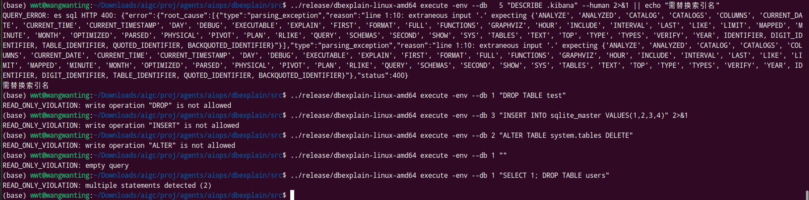

# L3: SQL 数据库执行测试

> 验证 SQL 类数据库的 `execute` 子命令：MySQL、PostgreSQL、ClickHouse、SQLite、Elasticsearch。

## 前置条件

```bash
cd src
# 建立数据库连接
dbexplain list -env
# 预期: 显示所有 15 个 DSN 的映射表
```

## 3.1 MySQL (DB1 - aiops-mysql)

### 基本 SELECT

```bash
dbexplain execute -env --db 1 "SELECT DATABASE() AS current_db, VERSION() AS version"
```

实际结果:
```json
{
  "columns": [{"name":"current_db"}, {"name":"version"}],
  "rows": [["testdb", "8.0.45"]],
  "row_count": 1
}
```

### 表查询

```bash
dbexplain execute -env --db 1 -human "SHOW TABLES"  
# 预期: 以表格形式显示所有表（iplist, port）
```

### 带 LIMIT 的查询

```bash
dbexplain execute -env --db 1 --human "SELECT * FROM information_schema.TABLES LIMIT 5" 
# 预期: 显示 5 行系统表信息
```

### JSON 输出

```bash
dbexplain execute -env --db 1 "SELECT * FROM information_schema.TABLES LIMIT 3"
# 预期: JSON 格式，包含 columns 和 rows 字段
```

### EXPLAIN 分析

```bash
dbexplain execute -env --db 1 --explain "SELECT * FROM information_schema.TABLES LIMIT 1"
# 预期: 返回 EXPLAIN 执行计划
```

### 空结果查询

```bash
dbexplain execute -env --db 1 --human "SELECT * FROM information_schema.TABLES WHERE 1=0" 
# 预期: 仅显示列头，无数据行
```

## 3.2 PostgreSQL (DB6 - video-pg)

### 基本 SELECT

```bash
dbexplain execute -env --db 6 --human "SELECT current_database() AS db, version() AS version" 
```

实际结果: 显示 videomon 数据库，PostgreSQL 16.12。

### 表查询

```bash
dbexplain execute -env --db 6 --human "SELECT table_name, table_schema FROM information_schema.tables WHERE table_schema NOT IN ('pg_catalog','information_schema') LIMIT 10" 
# 预期: 显示用户表列表
```

### EXPLAIN

```bash
dbexplain execute -env --db 6 --explain "SELECT * FROM information_schema.tables LIMIT 1"
# or for human
dbexplain execute -env --db 6 --human --explain "SELECT * FROM information_schema.tables LIMIT 1"
# 预期: 显示 PostgreSQL 执行计划
```

## 3.3 ClickHouse (DB2 - aiops-clickhouse)

### 版本查询

```bash
dbexplain execute -env --db 2 --human "SELECT version()" 
```

实际结果: ClickHouse 25.8.22.28。

### 数据库列表

```bash
dbexplain execute -env --db 2 --human "SHOW DATABASES" 
# 预期: 显示所有数据库
```

### 表查询

```bash
dbexplain execute -env --db 2 --human "SELECT database, name, engine FROM system.tables WHERE database NOT IN ('system','INFORMATION_SCHEMA') LIMIT 10" 
# 预期: 显示用户表的名称和引擎类型
```

## 3.4 SQLite (DB3 - intentapparatus-sqlite / rules.db)

### 基本查询

```bash
dbexplain execute -env --db 3 --human "SELECT sqlite_version() AS version" 
```

实际结果: SQLite 3.41.2。

### 表查询

```bash
dbexplain execute -env --db 3 --human "SELECT name, type FROM sqlite_master WHERE type='table' ORDER BY name" 
# 预期: 显示所有表名和类型
```

### 数据查询

```bash
dbexplain execute -env --db 3 --human "SELECT * FROM sqlite_master LIMIT 5" 
# 预期: 显示系统表的 CREATE 语句
```

## 3.5 SQLite (DB10 - veinmap-sqlite)

```bash
dbexplain execute -env --db 10 --human "SELECT name, type FROM sqlite_master WHERE type='table' ORDER BY name" 
# 预期: 显示 veinmap 数据库的表结构
# 实际: 4 tables
```

## 3.6 Elasticsearch (DB5 - aiops-es)

### 索引查询

```bash
dbexplain execute -env --db 5 --human "SHOW TABLES" 
# 预期: 显示 ES 索引列表
# 实际: 17 索引/视图
```

### 索引映射

```bash
# 查看具体索引映射（替换为实际索引名）
dbexplain execute -env --db 5 "DESCRIBE .kibana" --human 2>&1 || echo "需替换索引名"
# 预期: 显示索引映射字段
```

## 3.7 SQLGuard 沙箱验证

### 拒绝写入操作

```bash
dbexplain execute -env --db 1 "DROP TABLE test" 2>&1
# 实际: {"error":"READ_ONLY_VIOLATION: statement not allowed: DROP"}
```

```bash
dbexplain execute -env --db 3 "INSERT INTO sqlite_master VALUES(1,2,3,4)" 2>&1
# 预期: READ_ONLY_VIOLATION
```

```bash
dbexplain execute -env --db 2 "ALTER TABLE system.tables DELETE" 2>&1
# 预期: READ_ONLY_VIOLATION
```

### 空查询

```bash
dbexplain execute -env --db 1 "" 2>&1
# 预期: READ_ONLY_VIOLATION: empty query
```

### 多语句检测

```bash
dbexplain execute -env --db 1 "SELECT 1; DROP TABLE users" 2>&1
# 预期: READ_ONLY_VIOLATION
```



