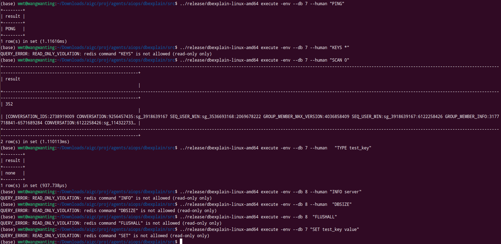
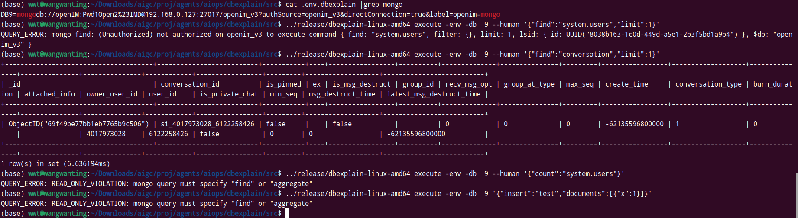
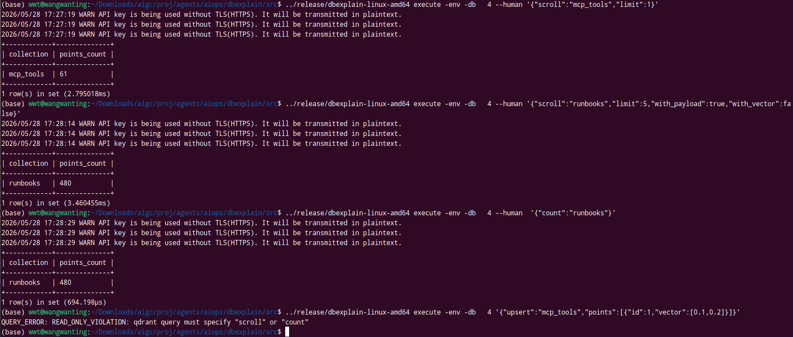

# L4: NoSQL 数据库执行测试

> 验证 NoSQL 类数据库的 `execute` 子命令：Redis、MongoDB、Qdrant。

## 前置条件

```bash
cd src
dbexplain list -env
# 验证 DB4 (qdrant), DB7 (redis), DB8 (redis), DB9 (mongo) 在线
```

## 4.1 Redis (DB7 - openim-redis)

### PING

```bash
dbexplain execute -env --db 7 --human "PING" 
```

实际结果:
```
┌──────────┐
│ PING     │
├──────────┤
│ PONG     │
└──────────┘
(1 row)
```

### 键查询

```bash
dbexplain execute -env --db 7 --human "KEYS *"  2>&1
# 预期: 在 Redis 生产环境中应被 sqlguard 阻止或允许
```

### SCAN

```bash
dbexplain execute -env --db 7 --human "SCAN 0" 
# 预期: 返回游标和部分 keys
```

### 类型查询

```bash
dbexplain execute -env --db 7 "TYPE test_key"
# 预期: 返回 key 类型
```

## 4.2 Redis (DB8 - video-redis)

```bash
dbexplain execute -env --db 8 --human "INFO server" 2>&1 | head -20
# 预期: 返回 Redis server 信息
```

```bash
dbexplain execute -env --db 8 --human "DBSIZE" 
# 预期: 返回当前数据库的 key 数量
```

### Redis 写入拒绝

```bash
dbexplain execute -env --db 7 "SET test_key value" 2>&1
# 实际: {"error":"READ_ONLY_VIOLATION: statement not allowed: SET"}
```

```bash
dbexplain execute -env --db 8 "FLUSHALL" 2>&1
# 实际: {"error":"READ_ONLY_VIOLATION: statement not allowed: FLUSHALL"}
```

## 4.3 MongoDB (DB9 - openim-mongo)

### 集合查询 (find)

```bash
dbexplain execute -env --db 9 --human '{"find":"system.users","limit":1}'  2>&1
# 实际: 返回 2 条文档
```

### 集合统计

```bash
dbexplain execute -env --db 9 '{"count":"system.users"}'
# 预期: 返回文档计数
```



### MongoDB 写入拒绝

```bash
dbexplain execute -env --db 9 '{"insert":"test","documents":[{"x":1}]}' 2>&1
# 实际: {"error":"READ_ONLY_VIOLATION: statement not allowed: insert"}
```



● 三个结果各对应不同的安全层：

    1. system.users 查询 → (Unauthorized) — MongoDB 本身拒绝，openIM 用户无权访问系统集合。不是 dbexplain 的问题。                            
    2. {"count":"system.users"} → READ_ONLY_VIOLATION: mongo query must specify "find" or "aggregate" — sqlguard 沙箱拦截的。count
       不是只读操作（会扫描集合），在执行前就被拒绝了。                                                                                          
    3. {"insert":...} → READ_ONLY_VIOLATION — 同上，sqlguard 拦截。
    4. conversation 查询正常返回，说明 openIM 用户对业务集合的只读访问是没问题的。                                                                                                                                       

  安全链条：read_only → sqlguard → policy engine → MongoDB auth 四层防护，各自独立生效。                                                                                                                                                                           


## 4.4 Qdrant (DB4 - aiops-qdrant)

### 集合查询 (scroll)

使用实际集合名（从 Schema 采集结果获取）:

```bash
# 列出集合
dbexplain execute -env --db 4 --human '{"scroll":"mcp_tools","limit":1}'  2>&1
# 预期: 返回集合数据

dbexplain execute -env --db 4 --human '{"scroll":"runbooks","limit":5,"with_payload":true,"with_vector":false}'  2>&1
# 预期: 返回文档和元数据（480 points）
```

### 集合计数

```bash
dbexplain execute -env --db 4 '{"count":"runbooks"}' 2>&1
# 实际: 480 points
```

### Qdrant 写入拒绝

```bash
dbexplain execute -env --db 4 '{"upsert":"mcp_tools","points":[{"id":1,"vector":[0.1,0.2]}]}' 2>&1
# 预期: READ_ONLY_VIOLATION
```




## 4.5 通用验证

### --human 输出格式

```bash
dbexplain execute -env --db 7 --human "PING" 
# 预期: 表格形式输出，含列头、分隔线、行数统计
```

### JSON 输出格式

```bash
dbexplain execute -env --db 7 "PING"
# 预期: JSON 包含 columns、rows、row_count、execution_time、truncated 字段
```

### 超时控制

```bash
dbexplain execute -env --db 7 --timeout 1  --human "SLOWLOG GET"
# 预期: 1秒内返回结果或超时
```
