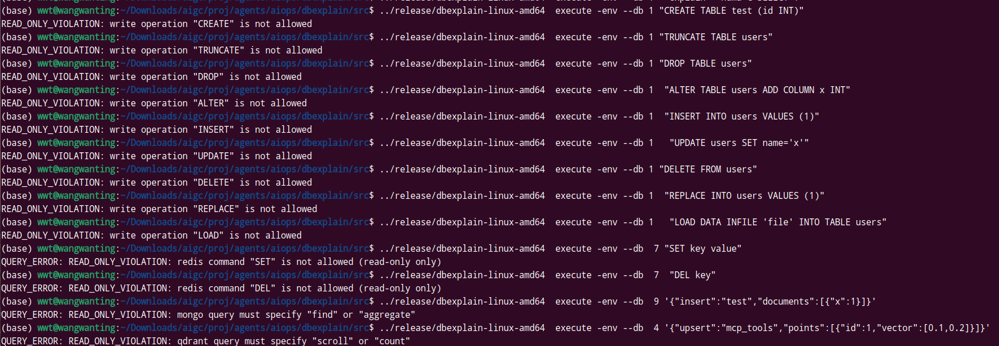
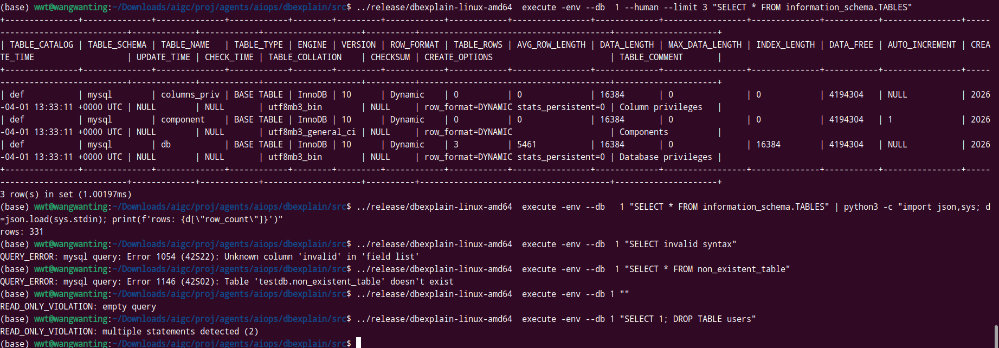

# L6: SQLGuard 沙箱测试

> 验证 sqlguard 只读校验机制对所有 SQL 数据库的正确性。

## 6.1 允许的语句 (ALLOW)

### SELECT

```bash
# MySQL
dbexplain execute -env --db 1 --human "SELECT 1" 
# 实际: +----------+
#       | SELECT 1 |
#       +----------+
#       |        1 |
#       +----------+
#       (1 row)

# PostgreSQL
dbexplain execute -env --db 6 --human "SELECT 1"
# 预期: 返回结果

# ClickHouse
dbexplain execute -env --db 2  --human "SELECT 1" 
# 预期: 返回结果

# SQLite
dbexplain execute -env --db 3 --human "SELECT 1" 
# 预期: 返回结果
```

### SHOW

```bash
dbexplain execute -env --db 1 --human "SHOW DATABASES"  2>&1 | head -5
# 预期: 显示数据库列表
```

### DESCRIBE

```bash
dbexplain execute -env --db 1 --human "DESCRIBE information_schema.TABLES"  2>&1 | head -5
# 预期: 显示表结构
```

### EXPLAIN

```bash
dbexplain execute -env --db 1 --explain "SELECT 1"
# 预期: 返回执行计划
```

## 6.2 拒绝的语句 (DENY)

### DDL

```bash
# CREATE
dbexplain execute -env --db 1 "CREATE TABLE test (id INT)" 2>&1
# 实际: {"error":"READ_ONLY_VIOLATION: statement not allowed: CREATE"}

# DROP
dbexplain execute -env --db 1 "DROP TABLE users" 2>&1
# 实际: {"error":"READ_ONLY_VIOLATION: statement not allowed: DROP"}

# ALTER
dbexplain execute -env --db 1 "ALTER TABLE users ADD COLUMN x INT" 2>&1
# 实际: {"error":"READ_ONLY_VIOLATION: statement not allowed: ALTER"}

# TRUNCATE
dbexplain execute -env --db 1 "TRUNCATE TABLE users" 2>&1
# 预期: READ_ONLY_VIOLATION
```

### DML

```bash
# INSERT
dbexplain execute -env --db 1 "INSERT INTO users VALUES (1)" 2>&1
# 实际: {"error":"READ_ONLY_VIOLATION: statement not allowed: INSERT"}

# UPDATE
dbexplain execute -env --db 1 "UPDATE users SET name='x'" 2>&1
# 实际: {"error":"READ_ONLY_VIOLATION: statement not allowed: UPDATE"}

# DELETE
dbexplain execute -env --db 1 "DELETE FROM users" 2>&1
# 实际: {"error":"READ_ONLY_VIOLATION: statement not allowed: DELETE"}
```



### MySQL 专用

```bash
dbexplain execute -env --db 1 "REPLACE INTO users VALUES (1)" 2>&1
# 预期: READ_ONLY_VIOLATION

dbexplain execute -env --db 1 "LOAD DATA INFILE 'file' INTO TABLE users" 2>&1
# 预期: READ_ONLY_VIOLATION
```

### Redis 写入

```bash
dbexplain execute -env --db 7 "SET key value" 2>&1
# 实际: {"error":"READ_ONLY_VIOLATION: statement not allowed: SET"}

dbexplain execute -env --db 7 "DEL key" 2>&1
# 预期: READ_ONLY_VIOLATION
```

### MongoDB 写入

```bash
dbexplain execute -env --db 9 '{"insert":"test","documents":[{"x":1}]}' 2>&1
# 实际: {"error":"READ_ONLY_VIOLATION: statement not allowed: insert"}
```

### Qdrant 写入

```bash
dbexplain execute -env --db 4 '{"upsert":"mcp_tools","points":[{"id":1,"vector":[0.1,0.2]}]}' 2>&1
# 预期: READ_ONLY_VIOLATION
```

## 6.3 Autolimit 功能

```bash
# --limit 参数控制最大行数
dbexplain execute -env --db 1 --human --limit 3 "SELECT * FROM information_schema.TABLES" 
# 预期: 仅返回 3 行
```

```bash
# 默认 limit 1000
dbexplain execute -env --db 1 "SELECT * FROM information_schema.TABLES" | python3 -c "import json,sys; d=json.load(sys.stdin); print(f'rows: {d[\"row_count\"]}')"
# 预期: row_count ≤ 1000
```

## 6.4 大小写不敏感

```bash
dbexplain execute -env --db 1  --human "select 1"
# 预期: 允许（小写 select 被识别）
```

## 6.5 错误处理

```bash
# 语法错误
dbexplain execute -env --db 1 "SELECT invalid syntax" 2>&1
# 预期: QUERY_ERROR

# 不存在的表
dbexplain execute -env --db 1 "SELECT * FROM non_existent_table" 2>&1
# 预期: QUERY_ERROR

# 空查询
dbexplain execute -env --db 1 "" 2>&1
# 实际: {"error":"READ_ONLY_VIOLATION: empty query"}

# 多语句检测
dbexplain execute -env --db 1 "SELECT 1; DROP TABLE users" 2>&1
# 实际: {"error":"READ_ONLY_VIOLATION: multi-statement not allowed"}
```


