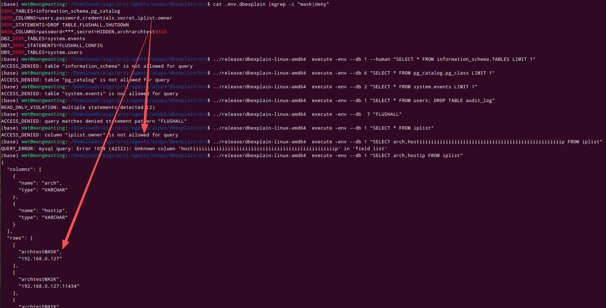

# L7: 策略引擎测试

> 验证 `policy` 包的三种拒绝策略和列值屏蔽功能。需要在 `.env` 文件中配置策略。

## 前置条件

在 `src/.env` 中添加测试策略（示例配置）：

```env
# 全局：禁止查询敏感表
DENY_TABLES=information_schema,pg_catalog

# 全局：禁止查询敏感字段
DENY_COLUMNS=users.password,credentials.secret

# 全局：禁止高危语句
DENY_STATEMENTS=DROP TABLE,FLUSHALL,SHUTDOWN

# 全局：列值屏蔽
MASK_COLUMNS=password=***,secret=HIDDEN
```

按 DSN 前缀配置：

```env
DB2_DENY_TABLES=system.events
DB7_DENY_STATEMENTS=FLUSHALL,CONFIG
DB9_DENY_TABLES=system.users
```

## 7.1 表级拒绝 (DENY_TABLES)

```bash
# MySQL - 禁止查询被拒绝的表
dbexplain execute -env --db 1 "SELECT * FROM information_schema.TABLES LIMIT 1" 2>&1
# 预期: POLICY_VIOLATION: table not allowed
```

```bash
# PostgreSQL - 禁止查询被拒绝的表
dbexplain execute -env --db 6 "SELECT * FROM pg_catalog.pg_class LIMIT 1" 2>&1
# 预期: POLICY_VIOLATION
```

```bash
# ClickHouse - DSN 级拒绝
dbexplain execute -env --db 2 "SELECT * FROM system.events LIMIT 1" 2>&1
# 预期: POLICY_VIOLATION
```

## 7.2 列级拒绝 (DENY_COLUMNS)

```bash
# 查询包含拒绝列时应该被阻止
dbexplain execute -env --db 1 "SELECT arch FROM iplist" 2>&1
# 预期: POLICY_VIOLATION（需确保 iplist 表存在且有 arch 列）
```

## 7.3 语句级拒绝 (DENY_STATEMENTS)

```bash
# 即使通过了 sqlguard 动词检查，策略引擎也会拒绝
dbexplain execute -env --db 1 "SELECT * FROM users; DROP TABLE audit_log" 2>&1
# 预期: POLICY_VIOLATION
```

```bash
# Redis - DSN 级 DENY_STATEMENTS
dbexplain execute -env --db 7 "FLUSHALL" 2>&1
# 预期: POLICY_VIOLATION（被 DB7_DENY_STATEMENTS 拦截）
```

## 7.4 列值屏蔽 (MASK_COLUMNS)

```bash
# 验证屏蔽列的值被替换
dbexplain execute -env --db 1 "SELECT * FROM iplist" 2>&1 || true
# 在存在匹配列的情况下，password 值会被替换为 "***"
```

## 7.5 允许的策略白名单验证

```bash
# 未在 DENY 列表中的表应正常查询
dbexplain execute -env --db 1 --human "SELECT 1" 
# 预期: 正常返回
```

## 7.6 策略配置验证

```bash
# 检查 .env 中是否包含策略配置
grep -E '^(DENY_|MASK_)' .env
# 预期: 显示已配置的策略行
```


